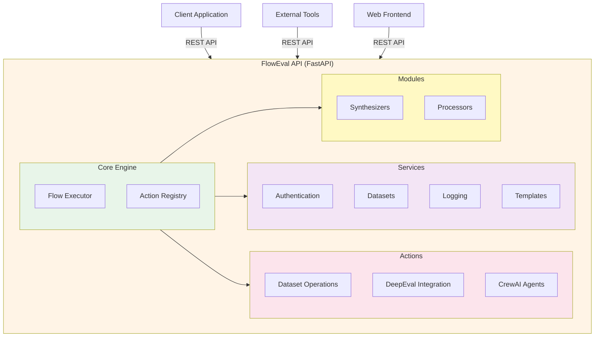

# FlowEval API

<div align="center">


**A production-grade backend API for creating and executing AI evaluation workflows**

FlowEval provides a comprehensive REST API for dataset management, AI evaluation pipelines, and workflow orchestration to streamline the entire AI development lifecycle.

[](LICENSE)
[](CHANGELOG.md)
[](docs/developer/contributing.md)
[](docs/README.md)
[](https://python.org)
[](https://fastapi.tiangolo.com)

**Excellence in Every Detail**: Modular architecture • Scalable design • Comprehensive documentation • Enterprise-ready

[Features](#-features) • [Quick Start](#-quick-start) • [Documentation](#-documentation) • [Contributing](#-contributing)

</div>

---

## ✨ Features

### Core Capabilities
- **RESTful API**: Comprehensive endpoints for workflow management and execution
- **Dataset Management**: Complete lifecycle management for training and evaluation datasets
- **Evaluation Engine**: DeepEval integration with custom metrics support
- **AI Orchestration**: CrewAI multi-agent workflows for complex tasks
- **Template Library**: 8+ pre-built flow templates for common use cases
- **Real-time Monitoring**: Live execution logs and status tracking

### Professional Features
- **Modular Architecture**: Organized codebase with clear separation of concerns
- **Type Safety**: Full Python type hints throughout with Pydantic validation
- **Authentication**: Secure user management with Supabase
- **PDF Processing**: Advanced extraction preserving document structure
- **Export Capabilities**: Multiple format support for datasets and results
- **Developer Tools**: Comprehensive API documentation and testing tools

## 🏗️ Architecture



**📖 See [docs/developer/architecture.md](docs/developer/architecture.md) for complete architecture documentation**

## 🚀 Quick Start

### Prerequisites

- **Python 3.9+**
- **pip** (Python package manager)
- **Google Gemini API key** (for AI capabilities)
- **Supabase account** (optional, for authentication)

### Installation

**1. Clone the repository**
```bash
git clone https://github.com/nkap360/floweval.git
cd floweval
```

**2. Backend Setup**
```bash
# Navigate to backend directory
cd backend

# Create virtual environment
python -m venv venv
source venv/bin/activate  # On Windows: venv\Scripts\activate

# Install dependencies
pip install -r requirements.txt

# Create environment file
cp ../.env.example .env

# Add your API keys to .env
GOOGLE_API_KEY=your-gemini-api-key
SUPABASE_URL=your-supabase-url
SUPABASE_KEY=your-supabase-key

# Start the API server
uvicorn main:app --reload --host 0.0.0.0 --port 8000
```

**3. Access the API**
- **API Base URL**: http://localhost:8000
- **Interactive API Docs**: http://localhost:8000/docs
- **Health Check**: http://localhost:8000/health
- **OpenAPI Schema**: http://localhost:8000/openapi.json

## 📚 Documentation

- **[docs/developer/architecture.md](docs/developer/architecture.md)** - Architecture deep-dive
- **[docs/developer/api-reference.md](docs/developer/api-reference.md)** - Complete API reference
- **[docs/developer/contributing.md](docs/developer/contributing.md)** - Development guidelines
- **[docs/deployment/](docs/deployment/)** - Deployment guides and production checklist
- **[docs/troubleshooting/](docs/troubleshooting/)** - Common issues and solutions
- **[Backend README](backend/README.md)** - Backend-specific documentation

## 🎯 Use Cases

FlowEval supports various AI evaluation scenarios through its REST API:

| Use Case | Description | Template Available |
|----------|-------------|-------------------|
| **Evaluation Baseline** | Establish baseline metrics for AI models | ✅ |
| **Golden Generation** | Create synthetic Q&A datasets from documents | ✅ |
| **Dataset Upload & Eval** | Upload and immediately evaluate datasets | ✅ |
| **Analytics & Quality** | Comprehensive quality sweeps on data | ✅ |
| **Production Monitoring** | Track model performance in production | ✅ |
| **Synthetic Experiments** | Generate and test synthetic scenarios | ✅ |
| **Lead Scoring** | CrewAI-powered multi-agent workflows | ✅ |
| **PDF Processing** | Extract structured data from PDFs | ✅ |

## 🛠️ Technology Stack

### Backend API
- **FastAPI** (Python 3.9+) - Modern, fast web framework
- **DeepEval** - Evaluation metrics and testing framework
- **CrewAI** - Multi-agent orchestration platform
- **Google Gemini** - LLM capabilities for AI tasks
- **Pydantic** - Data validation and serialization
- **Supabase** - Authentication and database services
- **Uvicorn** - ASGI server for production deployment

## 📦 Project Structure

```
floweval/
├── backend/
│   ├── actions/           # Action implementations
│   ├── core/              # Core engine (models, executor)
│   ├── services/          # Application services
│   ├── modules/           # Specialized modules
│   ├── config/            # Configuration
│   ├── utils/             # Utilities
│   ├── tests/             # Test suite
│   └── main.py            # API entry point
├── docs/                  # Documentation
│   ├── developer/         # Developer guides
│   ├── deployment/        # Deployment guides
│   └── troubleshooting/   # Troubleshooting docs
├── samples/               # Sample documents
├── prompts/               # AI prompts and templates
└── logs/                  # Application logs
```

## 🔧 Development

### Running Tests

```bash
cd backend
pytest                          # Run all tests
pytest --cov=backend           # With coverage
pytest -k test_flow_executor  # Specific test
pytest -v                      # Verbose output
```

### Code Quality

```bash
cd backend
make lint                     # Run flake8 linter
make format                   # Format with black and isort
make type-check               # Run mypy type checker
make test                     # Run tests with coverage
```

Or run commands individually:

```bash
black .                       # Format code
flake8 .                     # Lint code
mypy .                       # Type checking
isort .                      # Sort imports
```

## 🎨 Creating Custom Actions

See [docs/developer/contributing.md](docs/developer/contributing.md) for detailed guide.

**Quick example:**

```python
# backend/actions/actions_custom.py
from backend.core.actions import register_action, register_handler

register_action(
    action_id="my_action",
    name="My Custom Action",
    description="Does something awesome",
    node_type=NodeType.ACTION,
    params=[...]
)

@register_handler("my_action")
async def handle_my_action(node: FlowNode, context: dict) -> dict:
    # Implementation
    return {"result": "success"}
```

## 🚀 Deployment

### Docker

```bash
# Build the API image
docker build -t floweval-api .

# Run with environment variables
docker run -p 8000:8000 \
  -e GOOGLE_API_KEY=your_key \
  -e SUPABASE_URL=your_url \
  -e SUPABASE_KEY=your_key \
  floweval-api
```

### Docker Compose

```bash
# Copy environment template
cp .env.example .env

# Edit .env with your API keys
nano .env

# Start the API service
docker-compose up -d

# Access the API
# API: http://localhost:8000
# API Docs: http://localhost:8000/docs
```

### Cloud Platforms

- **Leapcell.io**: See [docs/deployment/leapcell.md](docs/deployment/leapcell.md)
- **AWS/Azure/GCP**: See [docs/deployment/overview.md](docs/deployment/overview.md)
- **Railway/Render**: Docker-based deployment supported
- **Self-hosted**: See [docs/deployment/production-checklist.md](docs/deployment/production-checklist.md)

## 📊 Flow Templates

8 pre-built templates available:

1. **Evaluation Baseline** - Establish model performance baselines
2. **Generate Goldens from Docs** - Auto-generate Q&A from documents
3. **Dataset Upload & Eval** - Quick upload and evaluate workflow
4. **Analytics Quality Sweep** - Comprehensive data quality checks
5. **PDF to Goldens** - Convert PDF documents to training data
6. **Production Monitoring** - Monitor deployed models
7. **Synthetic Experiments** - Generate and test synthetic data
8. **Lead Scoring (CrewAI)** - Multi-agent lead qualification

## 🤝 Contributing

We welcome contributions! Please follow these guidelines:

1. **Fork** the repository
2. **Create** a feature branch: `git checkout -b feature/amazing-feature`
3. **Commit** with clear messages: `git commit -m 'feat: add amazing feature'`
4. **Test** your changes thoroughly
5. **Document** new features in [DEVELOPER.md](DEVELOPER.md)
6. **Submit** a pull request

### Development Guidelines

- Follow existing code style (Black for Python, Prettier for TS)
- Add type hints to all functions
- Write tests for new features
- Update documentation
- Keep commits atomic and descriptive

## 🐛 Troubleshooting

**API won't start:**
```bash
# Check Python version
python --version  # Should be 3.9+

# Reinstall dependencies
pip install --upgrade -r requirements.txt

# Check environment variables
cat .env
```

**API connection issues:**
```bash
# Check if API is running
curl http://localhost:8000/health

# Check logs
docker logs <container_name>
# or
journalctl -u floweval-api
```

**Action not appearing:**
1. Verify action is registered in action module
2. Check ACTION_MODULES in main.py includes your module
3. Restart API server
4. Check API logs for errors

See [docs/troubleshooting/common-issues.md](docs/troubleshooting/common-issues.md) for more solutions.

## 📄 License

This project is licensed under the MIT License - see the [LICENSE](LICENSE) file for details.

## 🙏 Acknowledgments

Built with:
- [FastAPI](https://fastapi.tiangolo.com/)
- [DeepEval](https://docs.confident-ai.com/)
- [CrewAI](https://www.crewai.com/)
- [Supabase](https://supabase.com/)
- [Pydantic](https://pydantic-docs.helpmanual.io/)
- [Uvicorn](https://www.uvicorn.org/)

## 📞 Support

- **Documentation**: Check [docs/README.md](docs/README.md)
- **API Docs**: http://localhost:8000/docs (when running)
- **Issues**: [GitHub Issues](https://github.com/nkap360/floweval/issues)
- **Discussions**: [GitHub Discussions](https://github.com/nkap360/floweval/discussions)

## 🗺️ Roadmap

**Current (v1.0)**
- ✅ RESTful API for workflow management
- ✅ Dataset management
- ✅ 8 flow templates
- ✅ DeepEval integration
- ✅ CrewAI workflows

**Next (v1.1)**
- [ ] Advanced metrics dashboard
- [ ] More AI provider integrations
- [ ] Dataset versioning
- [ ] Rate limiting and caching
- [ ] Advanced authentication options

**Future (v2.0)**
- [ ] Distributed execution
- [ ] Custom metric SDK
- [ ] GraphQL API
- [ ] Enterprise features
- [ ] Multi-tenancy support

---

**Built with ❤️ for the AI community**

*FlowEval API: Where data meets intelligence*
